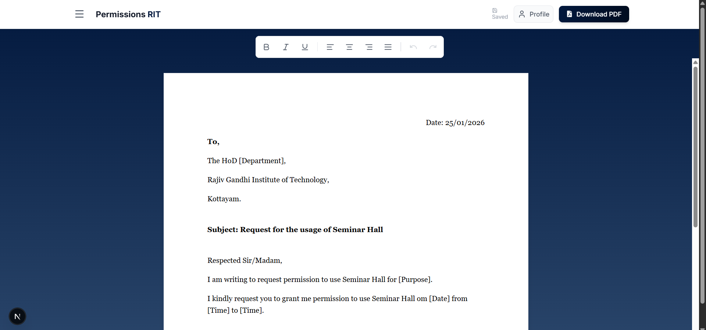

# Permissions-RIT | Official Letter Generator

A dedicated web application for students of **Rajiv Gandhi Institute of Technology (RIT), Kottayam** to effortlessly generate, format, and export official permission letters.


_(Note: You can add a screenshot of your app here)_

## 🚀 Overview

Writing permission letters for various college requirements (Auditorium access, Seminar halls, hour extensions) often involves repetitive formatting and drafting. **Permissions-RIT** simplifies this process by providing pre-made, official templates and a user-friendly editor that ensures your letters look professional and standardized.

## ✨ Features

- **📝 Smart Templates**: Pre-loaded templates for common requests:
  - Sopanam Hall Booking
  - College Auditorium Booking
  - Seminar Hall Access
  - Department Hour Extensions
- **🎨 Rich Text Editor**: Customize your letter with Bold, Italic, Underline, and Layout alignment tools.
- **👤 Student Profile Auto-fill**: Set your profile once (Name, Roll No, Dept) and automatically fill it into every template.
- **📱 Fully Responsive**: Optimized experience for both Mobile and Desktop usage. A4 preview scales perfectly on all screens.
- **💾 Local Auto-Save**: Never lose your draft; your work is automatically saved to your browser's local storage.
- **📄 Instant PDF Export**: generate a high-quality A4 PDF of your letter with a single click.

## 🛠️ Tech Stack

Built with modern web technologies:

- **Framework**: [Next.js 14](https://nextjs.org/) (React)
- **Styling**: [Tailwind CSS](https://tailwindcss.com/)
- **Animations**: [Framer Motion](https://www.framer.com/motion/)
- **Icons**: [Lucide React](https://lucide.dev/)
- **PDF Generation**: `html2canvas` + `jsPDF`

## 🏁 Getting Started

Follow these steps to run the project locally on your machine.

### Prerequisites

- Node.js installed (v18+ recommended)
- npm or yarn

### Installation

1. **Clone the repository**

   ```bash
   git clone https://github.com/your-username/Permissions-RIT.git
   cd Permissions-RIT
   ```

2. **Install dependencies**

   ```bash
   npm install
   # or
   yarn install
   ```

3. **Run the development server**

   ```bash
   npm run dev
   ```

4. **Open in Browser**
   Navigate to `http://localhost:3000` to see the application.

## 📖 Usage Guide

1. **Set Profile**: Click on the "Profile" icon in the top right to enter your Name, Roll Number, and Department.
2. **Choose Template**: Open the sidebar menu and select a template (e.g., "Sopanam Hall").
3. **Edit Content**: The template will auto-fill your details. You can further edit the date, time, and specific reasons directly in the editor.
4. **Format**: Use the floating toolbar to adjust text styles if needed.
5. **Download**: Click "Download PDF" to save the letter and print it for signing.

## 🤝 Contributing

Contributions are welcome! If you'd like to add more templates or features:

1. Fork the Project
2. Create your Feature Branch (`git checkout -b feature/AmazingFeature`)
3. Commit your Changes (`git commit -m 'Add some AmazingFeature'`)
4. Push to the Branch (`git push origin feature/AmazingFeature`)
5. Open a Pull Request

## 📄 License

This project is for educational and institutional use at RIT Kottayam.
